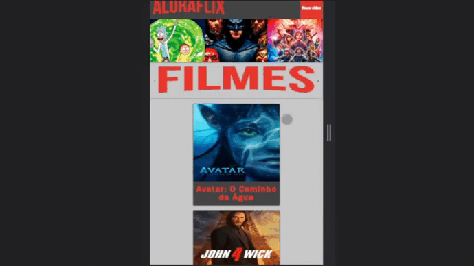
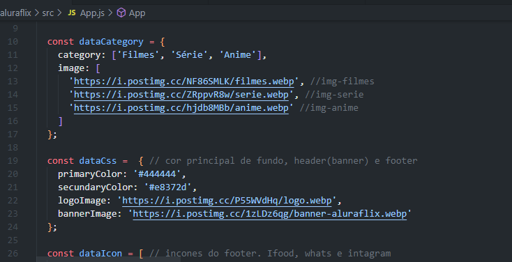

# Challenge ONE | React - AluraFlix
### Visite a página do Challenge [Clicando aqui!](https://www.alura.com.br/challenges/oracle-one-front-end/aluraflix) 📃
---

LINK PROJECT : https://matheusrelvinhas.github.io/aluraflix/

  

** Arquivo app.js tem um banco de dados com todos os caminhos de imagens e informações base para jogar no back-end, apenas atualize links de url, cor primária, imagens, etc **

** app.js file has a database with all image paths and base info to play in backend, just update url links, primary color, images, etc **

  

